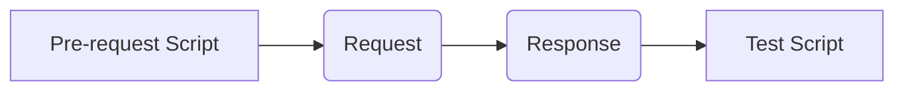

# Sourcing API Integration Testing

# Prerequisites

Below are the reference link where you can get started with **Sourcing Automation API Integration Testing Framework**
- [Install Postman](https://www.getpostman.com/apps)(Don't Use Google Chrome App, as it is going to be deprecated in few months.)
- [Basics of Postman](https://scotch.io/tutorials/write-api-tests-with-postman-and-newman)
- [Best Practices](http://blog.getpostman.com/2017/07/28/api-testing-tips-from-a-postman-professional/)
- [Documentation](https://www.getpostman.com/docs/v6/postman/launching_postman/installation_and_updates)

# Content
- Setup and Run
- BDD Testing with Postman
	- Collections
	- Environment(Global & Local)
	- Script Execution Flow
	- Runner
- Automation Process
	- Scenarios JSON
	- Collections Array
	- Newman API
	- Reports JSON
	- Reports HTML
	- Integrating in build process with Email notification

# Setup and Run

Follow below steps to setup up local integration test suit for local development.
- Get latest of **GEP IntegrationTest** from [**TFS**](\MAIN\GEP IntegrationTest)
- Open Command line at **IntegrationTest**
- Run **npm install** to install modules
- Run **npm run build** to convert ts to js
- use **npm start** to start automation

# BDD Testing with Postman

The way we have used postman to create the framework has been briefly described below:

# Collections

Collections are group of API requests executed in sequential order which can be organised into folders. Using this feature the architecture is structured depicting the behavior of a user. 

**E.g.** As a buyer i want to create an event by adding/changing Details, Timelines, Team member, Suppliers, etc.. and publish the event. All these change can be captured(copy **cURL**) from API calls in network.
Which is further imported to Postman and saved it as dynamic API into collection suit. So that this suit can be executed in different environment(dev, qc, ect...) and domains(atg, ascena, etc....) covering the publish scenario.

Multiple scenarios are covered and been exported to the folder [Features](\MAIN\GEP\ IntegrationTest\IntegrationTest\sourcing\rfx\features). Which can be imported to postman. 

**Convention:** buyer-event-publish(- separation of the name)

# Environment(Global & Local)

As Mentioned earlier the Environment variables are managed both in Environment an Domain level. 3 main values to be taken from particular environment are **cookie, userExecutionContext, and requestVerificationToken** through any API.

Environment variables act a local variable for a particular **Workspace**. and also for a particular collection in **Runner**. Global variables are rarely used as they connect in-between collection. Only **Global DD** is used, as to use the same event in whole scenario.

**Convention:** qc-atg(environment-domain)

# Script Execution Flow

When a postman request's for an API. Scripts are executed in the following order:
- **Pre-request Script** 
- **Request**
- **Response**
- **Test Script**

# Runner

Postman have a unique feature called **Runner** at top-left. Which can execute **single** collection with a environment along with other options Data, Iteration, etc...

But how to execute multiple collection for the same event to suffice our need. That's where **Golbal DD, Newman API, and Automation** come into play.

# Automation Process

Automation is introduction so that all the scenarios listed in [scenarios.json](\MAIN\GEP\ IntegrationTest\IntegrationTest) are executed during the build release. To know the environment stablility before-hand.

# Scenarios JSON

This JSON is the first point of contact for automation. Each scenario has a name, description, code, templates, and globalsDependent. 
- name and description are as it says
- code is used in cases like to differentiate generating report(html & xml) for same collection in different scenarios and used as id in [reports template](\MAIN\GEP\ IntegrationTest\IntegrationTest\reports\index.html).
- templates is an array of collections. Executed sequentially in the order of index. Contains properties **collection(name of the collection mention in the object with property collection), actor(name of the user mention in the object with in property environment), and data(name of the JSON file in the object with in the property data)**. All the properties includes the path of the exported JSON files.
- gobalsDependent is a flag used when there are more than one collection is used in templates. Briefly used to used same event for all the collection in a particular scenario.

# Collections Array

While executing the automation script **executeScenarios** function is executed first. Subsequently **executeTemplate** function transform the scenario json to array of objects with collection data.

**E.g.** Let S1,S2,S3... be scenario and C1,C2,C3... be collections. The final array contains data in the format of **[{S1-C1},{S2-C1},{S2-C2},{S3-C1},{S3-C2},{S3-C3}]**

# Newman API

As mentioned in the **Runner** section about the limitation on executing multiple collections. Newman's **Run** API along with recursion logic solves the issue. Understand the execution of function **executeCollection**. Debug using visual studio code line by line to gist the gist of logic.

# Reports JSON

Newman API gives a summary of the collection suit which had completed executing. Extracting necessary properties for reports constructed a new JSON. Which can be exported in the form of HTML or XML.

The function **generateScenariosReportObj** used in the recursion extracts the properties and create an array of objection related to scenarios as shown in [**ScenariosTestObj.json**](\MAIN\GEP\ IntegrationTest\IntegrationTest\reports\ScenariosTestObj.json).

# Reports HTML

As there is no concept of **DOM** or **Req/Res of API** to create a HTML using the **Reports JSON**. 

Used [Handlerbars](https://handlebarsjs.com/) to generate template engine. and [Cheerio](https://www.npmjs.com/package/cheerio) to use jQuery to bind data to html.

Refer function **generateScenariosReport** which is execute after the recursive function **executeCollection**.

# Integrating in build process with Email notification

To integration this automation in environments like DEV, QC, UAT, etc...Follow bellow steps
- Edit the release defination of the environment(e.g. GEPDEV_Sourcing.Web)
- Add new environment cluster **Sourcing TEST**
- In it add the sequence of commands necessary(**npm install, npm run build, npm start**).
- Finally build a new queue.
- All the reports are copied to blob and reports are exposed in [URL](http://gepmtstorage.blob.core.windows.net/sourcingreports/index.html). And a notification mail is sent

# For better view use [Stack Edit](https://stackedit.io/)